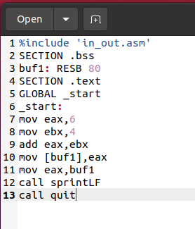
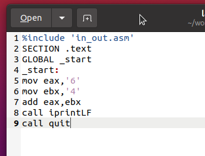
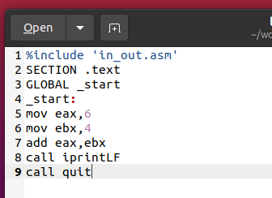
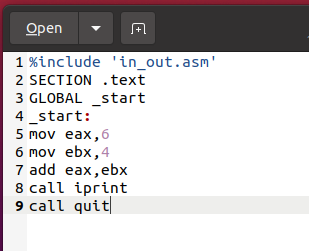
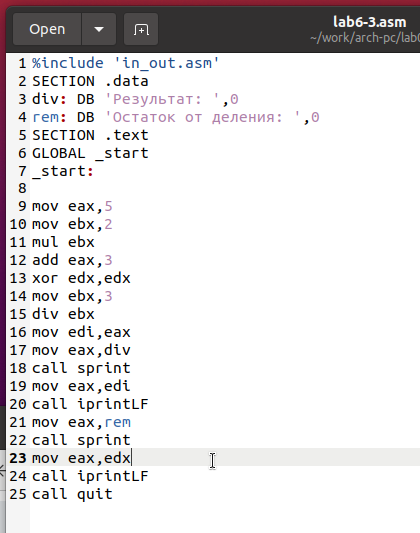
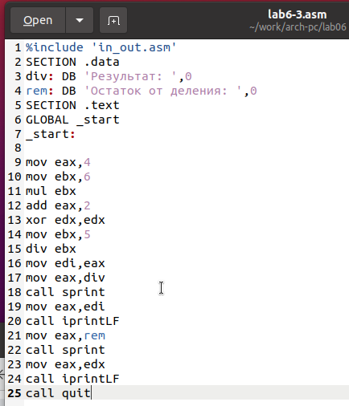
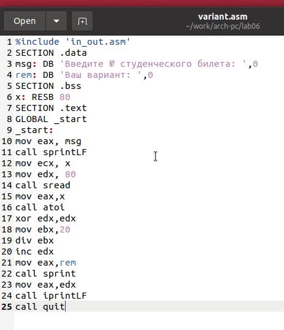
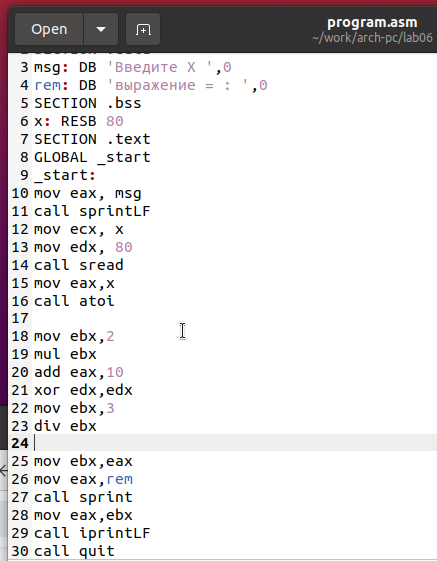

---
## Front matter
title: "Отчёт по лабораторной работе 6"
subtitle: "Архитектура компьютера"
author: "Эргешов Байрам НКАбд-02-23"

## Generic otions
lang: ru-RU
toc-title: "Содержание"

## Bibliography
bibliography: bib/cite.bib
csl: pandoc/csl/gost-r-7-0-5-2008-numeric.csl

## Pdf output format
toc: true # Table of contents
toc-depth: 2
lof: true # List of figures
lot: true # List of tables
fontsize: 12pt
linestretch: 1.5
papersize: a4
documentclass: scrreprt
## I18n polyglossia
polyglossia-lang:
  name: russian
  options:
	- spelling=modern
	- babelshorthands=true
polyglossia-otherlangs:
  name: english
## I18n babel
babel-lang: russian
babel-otherlangs: english
## Fonts
mainfont: PT Serif
romanfont: PT Serif
sansfont: PT Sans
monofont: PT Mono
mainfontoptions: Ligatures=TeX
romanfontoptions: Ligatures=TeX
sansfontoptions: Ligatures=TeX,Scale=MatchLowercase
monofontoptions: Scale=MatchLowercase,Scale=0.9
## Biblatex
biblatex: true
biblio-style: "gost-numeric"
biblatexoptions:
  - parentracker=true
  - backend=biber
  - hyperref=auto
  - language=auto
  - autolang=other*
  - citestyle=gost-numeric
## Pandoc-crossref LaTeX customization
figureTitle: "Рис."
tableTitle: "Таблица"
listingTitle: "Листинг"
lofTitle: "Список иллюстраций"
lotTitle: "Список таблиц"
lolTitle: "Листинги"
## Misc options
indent: true
header-includes:
  - \usepackage{indentfirst}
  - \usepackage{float} # keep figures where there are in the text
  - \floatplacement{figure}{H} # keep figures where there are in the text
---

# Цель работы

Целью работы является освоение арифметических инструкций языка ассемблера NASM.

# Выполнение лабораторной работы

Я создал каталог для программ лабораторной работы № 6, перешел в него и создал файл lab6-1.asm

В данной лабораторной работе мы рассмотрим примеры программ, которые выводят символьные и числовые значения. 
Программы будут использовать значение, записанное в регистре eax.

В этой программе мы записываем символ 6 в регистр eax (mov eax, '6'), 
и символ 4 в регистр ebx (mov ebx, '4'). 
Затем мы складываем значение в регистре eax с значением в регистре 
ebx (add eax, ebx), и выводим результат.

Для использования функции sprintLF, которая требует адрес в регистре eax, 
нам нужно использовать дополнительную переменную. 
Мы записываем значение регистра eax в переменную buf1 (mov [buf1], eax), 
затем записываем адрес переменной buf1 в регистр eax (mov eax, buf1), 
и вызываем функцию sprintLF.

{ #fig:001 width=70%, height=70% }

{ #fig:002 width=70%, height=70% }

В этом случае мы ожидаем увидеть число 10 при выводе значения регистра eax. 
Однако, результатом будет символ 'j'. Это происходит потому, что код символа 6 
равен 00110110 в двоичной системе (или 54 в десятичной системе), а код символа 4 
равен 00110100 (или 52). Команда add eax, ebx записывает в регистр eax сумму 
кодов – 01101010 (или 106), что в свою очередь является кодом символа 'j'.

Затем я изменил текст программы и вместо символов записал числа в регистры.

{ #fig:003 width=70%, height=70% }

{ #fig:004 width=70%, height=70% }

Как и в предыдущем случае, при выполнении программы мы не получим число 10. 
В данном случае будет выведен символ с кодом 10. Это символ конца строки (возврат каретки). 
В консоли он не отображается, но добавляет пустую строку.

Как уже упоминалось, в файле in_out.asm реализованы подпрограммы для преобразования ASCII 
символов в числа и обратно. Я изменил текст программы, используя эти функции.

{ #fig:005 width=70%, height=70% }

{ #fig:006 width=70%, height=70% }

В результате выполнения программы мы получим число 106. 
В данном случае, как и в первом примере, команда add складывает значения символов 
'6' и '4' (54+52=106). Однако, в отличие от предыдущей программы, функция iprintLF 
позволяет вывести число, а не символ, кодом которого является это число.

Аналогично предыдущему примеру, мы заменили символы на числа.

{ #fig:007 width=70%, height=70% }

Функция iprintLF позволяет вывести число и операндами были числа (а не коды символов).
Поэтому получаем число 10.

{ #fig:008 width=70%, height=70% }

Функция iprintLF позволяет вывести число, и в этом случае операнды являются числами 
(а не кодами символов). Поэтому мы получаем число 10.

Мы заменили функцию iprintLF на iprint. 
Создали исполняемый файл и запустили его. 
Вывод отличается тем, что нет переноса строки.

{ #fig:009 width=70%, height=70% }

{ #fig:010 width=70%, height=70% }

В качестве примера выполнения арифметических операций в NASM рассмотрели программу 
вычисления арифметического выражения $$f(x) = (5 * 2 + 3)/3$$.

{ #fig:011 width=70%, height=70% }

{ #fig:012 width=70%, height=70% }

Z изменил текст программы для вычисления выражения $$f(x) = (4 * 6 + 2)/5$$. 
Создал исполняемый файл и проверил его работу.

{ #fig:013 width=70%, height=70% }

{ #fig:014 width=70%, height=70% }

В качестве другого примера мы рассмотрели программу вычисления варианта задания по номеру студенческого билета.

В данном случае число, над которым необходимо выполнить арифметические операции, 
вводится с клавиатуры. Как уже упоминалось ранее, ввод с клавиатуры осуществляется в 
символьном виде, и для корректной работы арифметических операций в 
NASM символы необходимо преобразовать в числа. Для этого мы можем использовать функцию 
atoi из файла in_out.asm.

{ #fig:015 width=70%, height=70% }

{ #fig:016 width=70%, height=70% }

ответы на вопросы

1. Какие строки листинга отвечают за вывод на экран сообщения ‘Ваш вариант:’?

*Строка `mov eax, rem` перекладывает значение переменной с фразой "Ваш вариант:" в регистр eax. Строка `call sprint` вызывает подпрограмму для вывода строки на экран.*

2. Для чего используется следующие инструкции?

*Инструкция `mov ecx, x` перекладывает значение регистра ecx в переменную x. Инструкция `mov edx, 80` устанавливает значение 80 в регистр edx. Инструкция `call sread` вызывает подпрограмму для считывания значения из консоли.*

3. Для чего используется инструкция “call atoi”?

*Инструкция `call atoi` используется для преобразования введенных символов в числовой формат.*

4. Какие строки листинга отвечают за вычисления варианта?

*Строки листинга, отвечающие за вычисления варианта, включают: `xor edx, edx` (обнуление регистра edx), `mov ebx, 20` (установка значения 20 в регистр ebx), `div ebx` (деление номера студенческого билета на 20), `inc edx` (увеличение значения регистра edx на 1).*

5. В какой регистр записывается остаток от деления при выполнении инструкции “div ebx”?

*При выполнении инструкции `div ebx`, остаток от деления записывается в регистр edx*

6. Для чего используется инструкция “inc edx”?

*Инструкция `inc edx` используется для увеличения значения регистра edx на 1. В данном случае она используется для выполнения формулы вычисления варианта, где требуется добавить 1 к остатку от деления.*

7. Какие строки листинга отвечают за вывод на экран результата вычислений? 

*Строка `mov eax, edx` перекладывает результат вычислений в регистр eax. Строка `call iprintLF` вызывает подпрограмму для вывода значения на экран.*

## Задание для самостоятельной работы

Написать программу вычисления выражения y = f(x). Программа должна выводить выражение 
для вычисления, выводить запрос на ввод значения x, 
вычислять заданное выражение в зависимости от введенного x, выводить результат вычислений. 
Вид функции f(x) выбрать из таблицы 6.3 вариантов заданий в соответствии с номером 
полученным при выполнении лабораторной работы.
Создайте исполняемый файл и проверьте его работу для значений x1 и x2 из 6.3.

Вариант 1 - $(10 + 2x)/3$  для $x=1, x=10$ 

{ #fig:017 width=70%, height=70% }

при $x=1 f(x) = 4$

при $x=10 f(x) = 10$

{ #fig:018 width=70%, height=70% }

Программа считает верно.

# Выводы

Изучили работу с арифметическими операциями.
