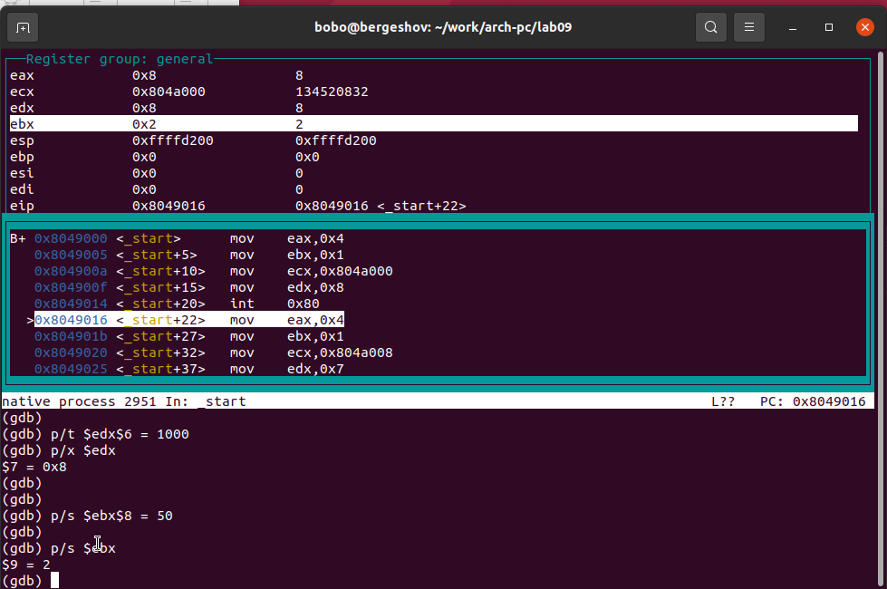

---
## Front matter
title: "Отчёт по лабораторной работе 9"
subtitle: "Архитектура компьютера"
author: "Эргешов Байрам НКАбд-02-23"

## Generic otions
lang: ru-RU
toc-title: "Содержание"

## Bibliography
bibliography: bib/cite.bib
csl: pandoc/csl/gost-r-7-0-5-2008-numeric.csl

## Pdf output format
toc: true # Table of contents
toc-depth: 2
lof: true # List of figures
lot: true # List of tables
fontsize: 12pt
linestretch: 1.5
papersize: a4
documentclass: scrreprt
## I18n polyglossia
polyglossia-lang:
  name: russian
  options:
	- spelling=modern
	- babelshorthands=true
polyglossia-otherlangs:
  name: english
## I18n babel
babel-lang: russian
babel-otherlangs: english
## Fonts
mainfont: PT Serif
romanfont: PT Serif
sansfont: PT Sans
monofont: PT Mono
mainfontoptions: Ligatures=TeX
romanfontoptions: Ligatures=TeX
sansfontoptions: Ligatures=TeX,Scale=MatchLowercase
monofontoptions: Scale=MatchLowercase,Scale=0.9
## Biblatex
biblatex: true
biblio-style: "gost-numeric"
biblatexoptions:
  - parentracker=true
  - backend=biber
  - hyperref=auto
  - language=auto
  - autolang=other*
  - citestyle=gost-numeric
## Pandoc-crossref LaTeX customization
figureTitle: "Рис."
tableTitle: "Таблица"
listingTitle: "Листинг"
lofTitle: "Список иллюстраций"
lotTitle: "Список таблиц"
lolTitle: "Листинги"
## Misc options
indent: true
header-includes:
  - \usepackage{indentfirst}
  - \usepackage{float} # keep figures where there are in the text
  - \floatplacement{figure}{H} # keep figures where there are in the text
---

# Цель работы

Целью работы является приобретение навыков написания программ с использованием подпрограмм.
Знакомство с методами отладки при помощи GDB и его основными возможностями.

# Выполнение лабораторной работы

Я создал каталог для выполнения лабораторной работы № 9 и перешел в него. 
Затем я создал файл lab9-1.asm.

В качестве примера рассмотрим программу, которая вычисляет арифметическое 
выражение $f(x) = 2x+7$ с помощью подпрограммы calcul. В данном примере значение 
$x$ вводится с клавиатуры, а само выражение вычисляется внутри подпрограммы.

{ #fig:001 width=70%, height=70% }

{ #fig:002 width=70%, height=70% }

Далее, я внес изменения в текст программы, добавив подпрограмму subcalcul внутри 
подпрограммы calcul для вычисления выражения $f(g(x))$, где значение $x$ также 
вводится с клавиатуры, а функции $f(x) = 2x + 7$ и $g(x) = 3x − 1$ вычисляются 
внутри подпрограмм.

{ #fig:003 width=70%, height=70% }

{ #fig:004 width=70%, height=70% }

Также, я создал файл lab9-2.asm с текстом программы из Листинга 9.2, 
который представляет программу печати сообщения "Hello world!".

{ #fig:005 width=70%, height=70% }

Получив исполняемый файл, я добавил отладочную информацию с помощью ключа '-g' для возможности работы с отладчиком GDB.

Затем я загрузил исполняемый файл в отладчик GDB и проверил работу программы, запустив ее с помощью команды 'run' (сокращенно 'r').

{ #fig:006 width=70%, height=70% }

Для более детального анализа программы, я установил точку остановки на метке 
'start', с которой начинается выполнение любой ассемблерной программы, и запустил 
ее. Затем я просмотрел дизассемблированный код программы.

{ #fig:007 width=70%, height=70% }

{ #fig:008 width=70%, height=70% }

Для проверки точки остановки по имени метки '_start', я использовал команду 
'info breakpoints' (сокращенно 'i b'). Затем я установил еще одну точку остановки 
по адресу инструкции, определив адрес предпоследней инструкции 'mov ebx, 0x0'.

{ #fig:009 width=70%, height=70% }

В отладчике GDB я имел возможность просматривать содержимое ячеек памяти 
и регистров, а также изменять значения регистров и переменных. 
Я выполнил 5 инструкций с помощью команды 'stepi' (сокращенно 'si') 
и отследил изменение значений регистров.

{ #fig:010 width=70%, height=70% }

{ #fig:011 width=70%, height=70% }

Для просмотра значения переменной msg1 по имени и получения нужных данных, я использовал соответствующую команду.

{ #fig:012 width=70%, height=70% }

Также, для изменения значения регистра или ячейки памяти, я использовал команду 
'set', указав имя регистра или адрес в качестве аргумента. 
Я успешно изменил первый символ переменной msg1.

{ #fig:013 width=70%, height=70% }

С помощью команды set изменил значение регистра ebx на нужное значение.

{ #fig:014 width=70%, height=70% }

Я скопировал файл lab8-2.asm, который был создан во время выполнения лабораторной 
работы №8 и содержит программу для вывода аргументов командной строки. 
Затем я создал исполняемый файл из скопированного файла.

Для загрузки программы с аргументами в отладчик GDB, я использовал ключ --args и загрузил исполняемый файл в отладчик с указанными аргументами.

Я установил точку останова перед первой инструкцией программы и запустил ее.

Адрес вершины стека, который содержит количество аргументов командной строки 
(включая имя программы), хранится в регистре ESP. По этому адресу находится 
число, указывающее количество аргументов. В данном случае видно, что количество 
аргументов равно 5, включая имя программы lab9-3 и сами аргументы: аргумент1, 
аргумент2 и 'аргумент 3'.

Я также просмотрел остальные позиции стека. По адресу [ESP+4] находится адрес 
в памяти, где располагается имя программы. По адресу [ESP+8] хранится адрес 
первого аргумента, по адресу [ESP+12] - второго и так далее. 
Шаг изменения адреса равен 4, так как каждый следующий адрес на стеке 
находится на расстоянии 4 байт от предыдущего ([ESP+4], [ESP+8], [ESP+12]).

{ #fig:015 width=70%, height=70% }

## Задание для самостоятельной работы

Преобразовал программу из лабораторной работы №8 (Задание №1 для
самостоятельной работы), реализовав вычисление значения функции f(x)
как подпрограмму.

{ #fig:016 width=70%, height=70% }

{ #fig:017 width=70%, height=70% }

В листинге приведена программа вычисления выражения $(3+2)*4+5$. 
При запуске данная программа дает неверный результат. Проверил это, 
анализируя изменения значений регистров с помощью отладчика GDB. 

Определил ошибку - перепутан порядок аргументов у инструкции add. 
Также обнаружил, что по окончании работы в edi отправляется ebx вместо eax.

{ #fig:018 width=70%, height=70% }

{ #fig:019 width=70%, height=70% }

Отмечу, что перепутан порядок аргументов у инструкции add и что по окончании работы в edi 
отправляется ebx вместо eax

Исправленный код программы

{ #fig:020 width=70%, height=70% }

{ #fig:021 width=70%, height=70% }

# Выводы

Освоили работy с подпрограммами и отладчиком.